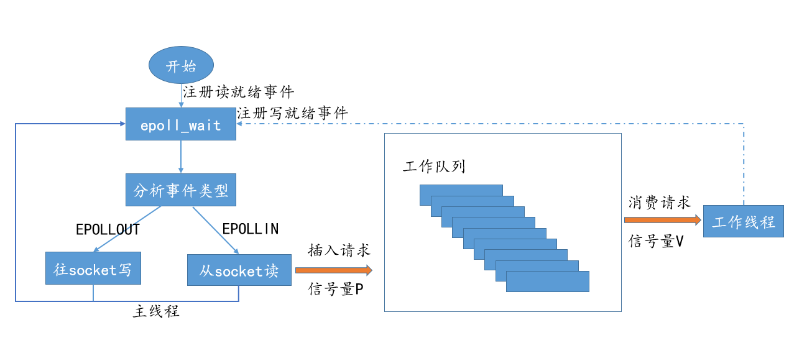

# 事件处理
## Reactor模式介绍
- Reactor模式，主线程只负责监听文件描述符上是否有事件发生，有的话就立即通将该线程通知工作线程，初次之外，主线程不做任何其他实质性的工作。
- Proactor模式将所有的I/O操作都交给主线程和内核来处理，工作线程仅仅负责业务逻辑。

项目中用到的是reactor的改进版本，使用同步I/O模式Proactor的方式，之所以不用异步IO(aio_read/aio_write)是因为异步I/O编程较复杂。使用同步IO模拟reactor的方式，可以把IO和业务分离，同时可以把业务加入到缓冲队列中，使得IO和业务并发异步进行。

下图是项目所使用的同步IO模拟Procator模式的流程图：

主线程事件分离，同时负责IO和业务分离，主线程负责IO、工作线程负责业务，是一个生产者消费者模模型。