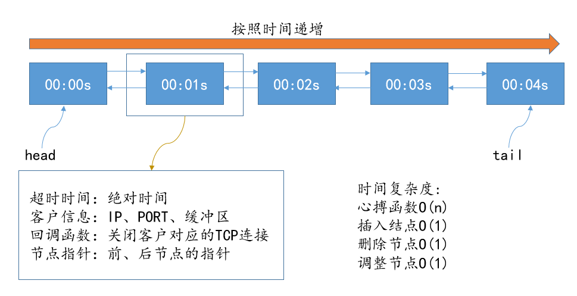

# 定时器
定时器主要参考《Linux高性能服务器编程》11章。文中给出了三种定时器模型，分别是升序链表、时间轮、时间堆定时器
## 1、Linux定时的三种方法

(1) socket的SO_RECVTIMEO和SO_SENDTIMEO

(2) SIGALRM 信号

(3) I/O复用系统调用的超时参数

## 2、socket超时选项

- send、sendmsg设置**SO_SENDTIMEO**，超时设置errno为EAGAIN或者EWOULDBLOCK
- recv、recvmsg、accept设置**SO_RECVTIMEO**，超时设置errno为EAGIN或者EWOULDBLOCK
- connect设置**SO_SENDTIMEO**，超时设置errno为EINPROGRESS
## 3、SIGALRM信号

由alarm和setitimer函数设置的时钟一旦超时，将触发SIGALRM信号。

## 4、简单升序链表

升序链表定时器的数据结构如上图所示，每个定时器节点前后相连组成双向链表。每个定时器节点包含一个用户TCP连接的数据，主要为客户端socket地址、socket文件描述符、读写缓存。

升序链表定时器的主要函数是tick( )心搏函数，在心搏函数里面，会清除到期的定时器节点，定关闭相对应的TCP连接，这是一个遍历的过程，  时间复杂度是O(n)。

删除一个节点，主要被心搏函数调用，时间复杂度是O(1)。

添加一个新的节点，只需要把把节点插入到链表尾部，时间复杂度是O(1)。

调整节点，更新节点的时间，毫无疑问，更新后的节点的时间肯定是最大的，只需要插入到链表尾部，时间复杂速度是O(1)。

## 5、时间轮定时器

时间轮的数据结构是一个循环队列，有一个指针si用来指向轮子上的一个桶，每次转动称为一个滴答。每个槽指向一条定时器链表。时间轮根据定时器到期时间与当前时间的差值，把每次定时器散列到不同的桶里面。

## 6、时间堆定时器

将所有的定时器超时时间最小的一个定时器超时时间作为心搏间隔。这样一旦心搏函数被调用，超时时间最小的定时器必然到期，我们就可以在tick函数中处理该定时器。然后再从最小时间设置为下一次心搏间隔，如此反复，就实现了比较精确的定时。

### 7、三种定时器比较
- 对于简单升序链表插入、删除、更新的时间复杂度都是O(1)，心搏函数的时间复杂度是O(n)，这个时间复杂度虽然是O(n)，但是可以确保每次删除的都是已经到期的节点，因此并每天做其他多余的动作。

- 对于时间轮定时器，其插入、删除、心搏的时间复杂度都是O(1),但是真正花费的时间是要比简单升序链表要多的，精度主要取决于轮子槽的个数。

- 时间堆定时器添加和更新一个节点的时间复杂度是O(lgn)，删除和心搏的复杂度是O(1)，但是可以做到较为准确的定时。

### 8、能否用I/O复用系统调用的超时函数
I/O复用系统调用可能在超时时间到期之前就返回，所以如果我们利用他们来定时，就需要不断更新定时参数以反映剩余时间，这样精度虽然很高，但是其实让代码变得更加复杂。

